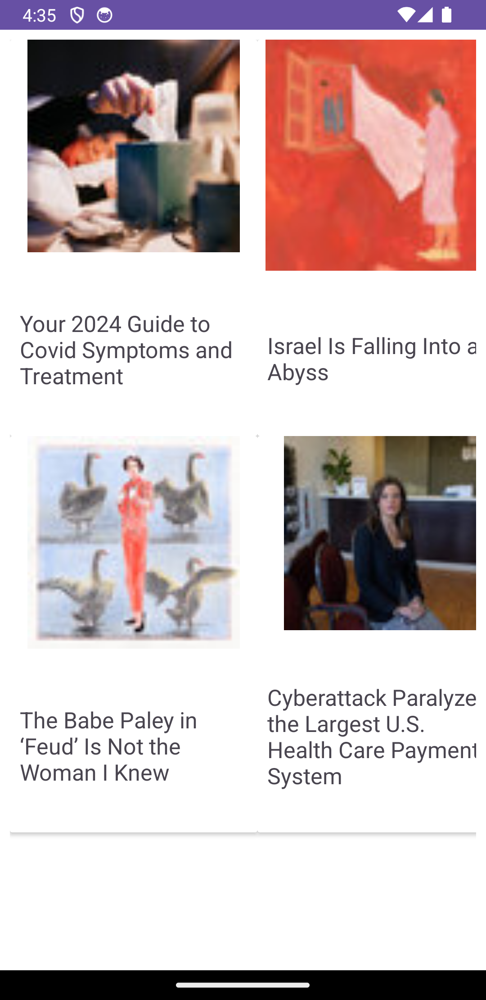
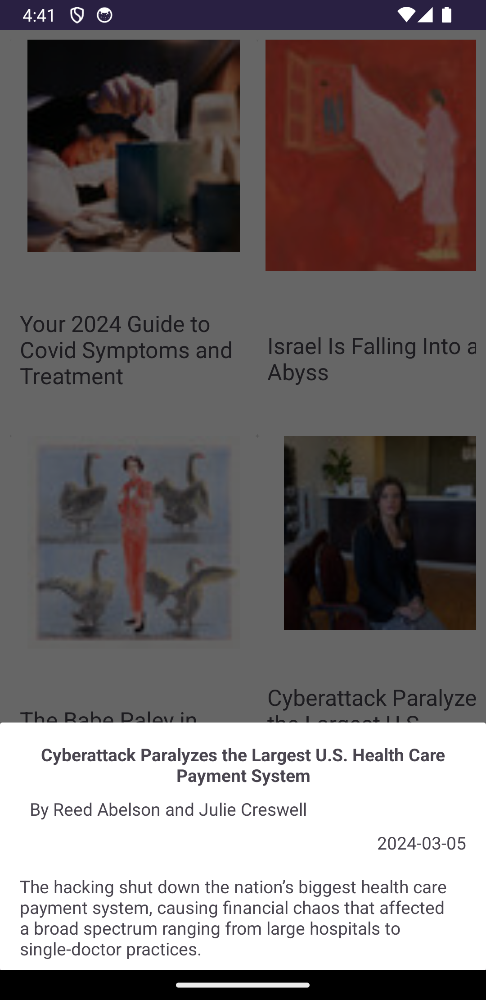

# Raven News

This is a multi-module project that implements MVVM architecture , StatesFlows to communication between viewmodel and view, coroutines to implement async tasks, retrofilt to consume web apis , Room to local data persistence.
To show the most popular news and it details from The New York Times Api. 
## Requirements

- Android API 24 or higher
- Programming Language: Kotlin

## Project Setup

1. Clone the repository to your local machine:
 
  ```sh
  Git clone https://github.com/neryto/RavenNews.git
  ```
2. Open the project in Android Studio.

3. Sync the project dependencies.

  ## Modules 

1. app
- Contains the App class
- Contains the entry point of the app
- Handle the navigation
2. buildSrc
- Manage dependencies of the proyect 
3. common
- Contains code that is frequently used by other modules 
4. core
- Contains clases bases such as BaseUseCase
5. database  
- Handle local persistence data. This module is shared between the features modules to share data
6. features
- Contains isolated part of an app's functionality that usually corresponds to a screen or series of closely related screens
- Each feature contains its data, domain and presentation layers 

## Features
1. list
- Consume The New York Times api to show a list of most pupular news and store it into local database to fetch it in case of there are no internet conection
  
     
     
2. detail
- Fetch news data from local database and show the deatail of the selected new from list screen

   

        
  ## Netx steeps
   - Implement loading 

  ## Contact

If you have any questions or a pice of advice to improve this project, you can contact Nery Bustos at nery.h.bustos@gmail.com.


  

